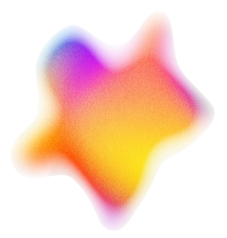

<h1 align="center">Hola 👋   Soy Federico G. Gutierrez</a></h1>

 
     
    
    

- 🧮 Profesor de Matemática

- 👨🏼‍🏫 Estudiante de la `Carrera de Data Scientist` y `Carrera de Data Analytics` en &nbsp;&nbsp;

- 📄 Conoce mis experiencias <a href="" target="blank">Curriculum Vitae</a>.
 

<h2 align="center">🛠️ Lenguajes de programación y herramientas 🛠️</h2>

    
    &nbsp;
    
    &nbsp;
    
    &nbsp;
    
    &nbsp;
    
    &nbsp;
    
    &nbsp;
    
    &nbsp;
    
    &nbsp;
    
    &nbsp;
    
    &nbsp;
    
    &nbsp;
    
    &nbsp;
    
    &nbsp;
    
    &nbsp;
    
    &nbsp;
    

<h2 align="center">📚 Capacitaciones 📚 </h2>

|🥚 Egg Cooperation 🥚|🧉 Argentina Programa 4.0 🧉|
|:---:|:---:|
| [Programación desde cero](https://demo-egg-certificates.s3.amazonaws.com/FedericoGabrielGutierrez/programaci%C3%B3ndesdecerolatam/thumbnail_f3842983de1a7d203664e91f8cdc8530d75575d9ea2ae4d3c2e225375682d697.jpeg) | [Primeros pasos del desarrollo frontend](https://drive.google.com/file/d/1515Bcy4hGdobzeDxOSyLe5kmVp-0Eq_Y/view?usp=sharing) |
| [Programación Web desde cero](https://demo-egg-certificates.s3.amazonaws.com/FedericoGabrielGutierrez/programaci%C3%B3ndesdecerolatam/thumbnail_f3842983de1a7d203664e91f8cdc8530d75575d9ea2ae4d3c2e225375682d697.jpeg) | [Desarrollador con conocimientos complementarios en el proceso de datos con Python](https://drive.google.com/file/d/1SkbRNg_086TElDsLmwMBhfzNecy6P1D7/view?usp=sharing) |
|<b>💎 Lumetrio 💎</b>|<b>🚀 Talento Tech (ex Codo a Codo) 🚀</b>|
| [Introducción a la Programación](https://lumetrio.com/certificado/2086142bcefd37c4017a8) | [Full Stack Python](https://drive.google.com/file/d/1LbpYVB4MvOxZx4rpVx_PH-j8_vhc1e_U/view?usp=sharing) |
| [Programación Frontend](https://lumetrio.com/certificado/20862bcbb1bcd3cf835db) | [BackEnd Node JS](https://drive.google.com/file/d/1L46wTK7QcFp6lzWnDXjxGAYi7Epablus/view?usp=sharing) |
| [Python](https://lumetrio.com/certificado/20865d3165b9228fa0c96) | [Iniciación a la Programación con Python](https://drive.google.com/file/d/1eLMbjnwjVip6VpYYJrvgT7-ySJjnAPiX/view?usp=sharing) |
| [React](https://lumetrio.com/certificado/2086729e93aab4bd650fd) |[Testing QA]() |
| [Git y Github](https://lumetrio.com/certificado/20864454c6075c8b691d9) | [Testing QA & Automation]()|
|<b>🟡 Coderhouse 🟡</b>| <b>🔥 Santander Open Academy 🔥</b>|
| [Desarrollo Web](https://pub.coderhouse.com/legacy-certificates/65c0a148a665c35259cc62a3?lang=es) | [Google: Inteligencia Artificial y productividad](https://drive.google.com/file/d/1PCssWgcS_NSgHnJycS2aRDsRbbbk2HwK/view?usp=drive_link) |
| [JavaScript](https://pub.coderhouse.com/legacy-certificates/66158e00451ec417dfb30263?lang=es) | [Copilot](https://drive.google.com/file/d/1KHq8STQeGyLAKHRiMj_v7nkCXnpQR7je/view?usp=drive_link) |
| [React Js](https://pub.coderhouse.com/legacy-certificates/664be1fdc35d22af7ccbacda?lang=es) | [Introducción a la Ciencia de Datos](https://drive.google.com/file/d/1I8JOrpYBE_yUtf77cY-hQ5e-1BtfXvWz/view?usp=drive_link) |
| [Carrera de Desarrollo Frontend React](https://pub.coderhouse.com/legacy-certificates/664be1fdc35d221341cbace5?lang=es) | [Power BI](https://drive.google.com/file/d/1iG7jLa-r7vYB1Y1TgPGSiMnYDhrThP6g/view?usp=drive_link) |
| [Programación Backend I: Desarrollo Avanzado de Backend](https://pub.coderhouse.com/legacy-certificates/66a4638e64c8734d4c85aa10?lang=es) | |
| [Programación Backend II: Diseño y Arquitectura Backend](https://pub.coderhouse.com/legacy-certificates/66f5b32dd1c51d20ed892031?lang=es) | |
| [Programación Backend III: Testing y Escalabilidad Backend](https://pub.coderhouse.com/legacy-certificates/67506c7b4ea27fc1cf1d02ef?lang=es) | |
| [Fundamentos de Inteligencia Artificial](https://pub.coderhouse.com/certificates/1edc3ff8-fff7-4f18-9b71-234e19d5ee31?v=1) | |
| [Inteligencia Artificial: Generación de Prompts](https://pub.coderhouse.com/certificates/b9447d09-9e47-4efb-b76d-cbab513f5fa7?v=1) | |
| [SQL]() | |
| [Testing QA Manual]() | |
| [Data Analytics]() | |
| [Data Science I: Fundamentos para la Ciencia de Datos]() | |
| [Data Science II: Machine Learning para la Ciencia de Datos]() | |
| [Data Science III: NLP & Deep Learning aplicado a Ciencia de Datos]() | |
| [Carrera de Data Scientist]() | |
| [Excel]() | |
| [Tableau]() | |
| [Data Analytics]() | |
| [Carrera de Data Analytics]() | |

<h2 align="center">🧑🏽‍💻 Proyectos 🧑🏽‍💻</h2>

&nbsp;&nbsp;

&nbsp;&nbsp;

&nbsp;&nbsp;

&nbsp;&nbsp;

&nbsp;&nbsp;

&nbsp;&nbsp;

&nbsp;&nbsp;

&nbsp;&nbsp;

&nbsp;&nbsp;

&nbsp;&nbsp;

&nbsp;&nbsp;

&nbsp;&nbsp;

&nbsp;&nbsp;

&nbsp;&nbsp;

&nbsp;&nbsp;

&nbsp;&nbsp;

&nbsp;&nbsp;

&nbsp;&nbsp;

&nbsp;&nbsp;

&nbsp;&nbsp;

&nbsp;&nbsp;

&nbsp;&nbsp;

&nbsp;&nbsp;

&nbsp;&nbsp;

&nbsp;&nbsp;

&nbsp;&nbsp;

<h2 align="center">✅ Aprendizaje avalado por ✅ </h2>

&nbsp;&nbsp;

&nbsp;&nbsp;

&nbsp;&nbsp;

&nbsp;&nbsp;

&nbsp;&nbsp;

<h2 align="center">📫 Contactame en 📫</h2>

    
    &nbsp;
    
    &nbsp;
    
    &nbsp;
    <a href="mailto:gutierrezfedericog@gmail.com" target="_blank">
    

_________________________________________________________________________________________________________
**Última actualización - 27 de febrero de 2025**