<h1 align="center">Hola 👋   Soy Federico G. Gutierrez</a></h1>

 
     
    
    

- 🧮 Profesor de Matemática

- 👨🏼‍🏫 Estudiante de la `Carrera de Data Analytics` en &nbsp;&nbsp;

- 🗂️ Accede a mi [`Portfolio Personal`](https://is.gd/jMfbIU)

<h2 align="center">🛠️ Lenguajes de programación y herramientas 🛠️</h2>

    
    &nbsp;
    
    &nbsp;
    
    &nbsp;
    
    &nbsp;
    
    &nbsp;
    
    &nbsp;
    
    &nbsp;
    
    &nbsp;
    
    &nbsp;
    
    &nbsp;
    
    &nbsp;
    
    &nbsp;
    
    &nbsp;
    
    &nbsp;
    
    &nbsp;
    
    &nbsp;
    
    &nbsp;
    
    &nbsp;
    
    &nbsp;
    
    &nbsp;
    
    &nbsp;
    
    &nbsp;
    
    &nbsp;
    
    &nbsp;
    
    &nbsp;
    
    &nbsp;
    
    &nbsp;
    
    &nbsp;
    
    &nbsp;
    
    &nbsp;
    
    &nbsp;
    
    &nbsp;
    
    &nbsp;
    

<h2 align="center">📚 Capacitaciones 📚</h2>

### 🥚 Egg Cooperation

- [Programación desde cero](https://is.gd/cqiZO1)
- [Programación Web desde cero](https://is.gd/4QTUGL)

---

### 🧉 Argentina Programa 4.0

- [Primeros pasos del desarrollo frontend](https://is.gd/n5K5fe)
- [Desarrollador con conocimientos complementarios en el proceso de datos con Python](https://is.gd/aTP7aA)

---

### 💎 Lumetrio
- [Introducción a la Programación](https://is.gd/B7krrW)
- [Programación Frontend](https://is.gd/yUXa02)
- [Python](https://is.gd/kxMOEt)
- [React](https://is.gd/ytzFLo)
- [Git y Github](https://is.gd/dJmglc)

---

### 🔵 Educación IT
- [Introducción a la Programación](https://is.gd/oJITYy)

---

### 🚀 Talento Tech (ex Codo a Codo)
- [Full Stack Python](https://is.gd/3mRIw4)
- [BackEnd Node JS](https://is.gd/FTsqtK)
- [Iniciación a la Programación con Python](https://is.gd/YIfx5m)
- [Business Intelligence](https://is.gd/jogV7q)
- [Introducción a la IA](https://is.gd/mFWwid)
- [Construí Tu Futuro - Comunicación Efectiva](https://is.gd/akSTUn)
- [Multimedia con IA](https://http.cat/401)

---

### 🟡 Coderhouse
**Frontend y Backend**
- [Desarrollo Web](https://is.gd/rzGj0Z)
- [JavaScript](https://is.gd/3nqfF9)
- [React Js](https://is.gd/RgTcox)
- [Carrera de Desarrollo Frontend React](https://is.gd/bPnPIb)
- [Programación Backend I](https://is.gd/jvSHoT)
- [Programación Backend II](https://is.gd/hvz5lp)
- [Programación Backend III](https://is.gd/9KvgUR)
- [SQL](https://is.gd/zwcWF7)
- [Testing QA Manual](https://is.gd/jnfBgu)

**Inteligencia Artificial**
- [Fundamentos de Inteligencia Artificial](https://is.gd/k6NUUK)
- [Generación de Prompts con IA](https://is.gd/wMgNh2)
- [IA Automation](https://is.gd/EdYrkb)

**Ciencias de Datos**
- [Data Analytics](https://is.gd/of4aYH)
- [Data Science I: Fundamentos de la Ciencia de Datos](https://is.gd/ypu76X)
- [Data Science II: Machine Learning para la Ciencia de Datos](https://is.gd/2wqLiF)
- [Data Science III: NLP & Deep Learning aplicado a la Ciencia de Datos](https://is.gd/TcQZW8)
- [Carrera de Data Scientist](https://is.gd/nSTc39)

**Academia de Inglés**
- [Inglés para el mundo digital - Nivel Elementary](https://is.gd/B40x5e)

**Análisis de Datos**
- [Excel](https://is.gd/2YJLx9)
- [Tableau](https://is.gd/oHuM2b)
- [Data Analytics](https://http.cat/401)
- [Carrera de Data Analytics](https://http.cat/401)

---

### 🔥 Santander Open Academy
- [Google: Inteligencia Artificial y productividad](https://is.gd/RHecXd)
- [Copilot](https://is.gd/hNVp3M)
- [Introducción a la Ciencia de Datos](https://is.gd/g6jUIB)
- [Power BI](https://is.gd/6T86vs)
- [Liderazgo](https://is.gd/z8VCo9)
- [Escritura efectiva y persuasiva](https://is.gd/Qqysb0)
- [Mindfulness & Work-life balance](https://is.gd/9cZohK)
- [Mejores Prácticas en la Enseñanza Online y el Nuevo Rol del Educador](https://is.gd/WTWSUh)

---

### Ⓜ️ Fundación Mauricio Macri
- [Trayecto 1 - El nuevo liderazgo escolar en el contexto actual](https://is.gd/fDEzOo)
- [Trayecto 2 - La escuela como agente de cambio: Desarrollo Profesional Docente y desarrollo de la comunidad](https://is.gd/BzuYTm)
- [Trayecto 3 - Metodologías activas: Estrategias para un aprendizaje pleno](https://is.gd/zz096b)
- [Trayecto 4 - Grandes desafíos de hoy: El clima escolar y la evaluación](https://is.gd/9KNmIq)
- [Programa de Liderazgo Educativo](https://is.gd/BTeP0I)

---

### 🧠 Learny
- [Neuroaprendizaje: 10 claves para un aprendizaje cerebro-compatible](https://is.gd/MVsbl3)
- [Neurosugerencias pedagógicas para favorecer el aprendizaje en el aula](https://is.gd/jUMXuf)
- [Neuroprogramación para la venta](https://is.gd/4WXfYT)
- [Learny Live Nueropedagogía Aplicada](https://is.gd/JKgPRo)

---

### 🇦🇷 Argentina Programa 4.0
- [Primeros pasos del desarrollo frontend](https://is.gd/lUiUjV)
- [Procesamiento de datos con Python](https://is.gd/JTNzQa)

---

### 🇦🇷 Plataforma de aprendizaje virtual
- [Primeros pasos del desarrollo frontend](https://is.gd/lUiUjV)
- [Procesamiento de datos con Python](https://is.gd/JTNzQa)

---

### 🚀 BA Multiplica
- [Curso de BA Multiplica](https://is.gd/vbq7GT)

---

### 🌐 UAI
- [Diplomado Universitario de Capacitación Docente en Neurociencias](https://is.gd/uoOU4y)
- [10° Jornada Internacional de Neuroeducación e Inteligencia Emocional](https://is.gd/f886Jf)

---

### 💻 UTN
- [Tecnología Educativa](https://is.gd/mwbyEf)

---

### 🟢 UCES
- [Diplomatura Superior de Comunicación en las Instituciones Educativas]()
- [Diplomatura Superior en Diversidad y educación]()

---

### ⭐ UNC
- [Introducción a la Fotografía](https://is.gd/6kqWLG)
- [IA y automatización de flujos de trabajo: aprende a automatizar de forma eficaz y eficiente](https://is.gd/D9iVlu)
- [Herramientas de inteligencia artificial para docentes 1](https://is.gd/xplemi)
- [Herramientas de inteligencia artificial para docentes 2](https://is.gd/1HgQxd)

---

### 🌎 Fundación ILADES
- [Diplomado en formación de Bibliotecología y Archivología](https://is.gd/M8rd3k)
- [Diplomado en Nutrición y Suplementario Deportiva](https://is.gd/KmEJny)

---

### 💼 CFAP
- [Protocolo y Ceremonial](https://is.gd/ItJsUi)
- [Administración de Recursos](https://is.gd/4uAaGd)
- [Trabajo en Equipo](https://is.gd/OPXK8z)

---

### 👨🏻‍🏫 CIIE
- [¿Por qué es importante enseñar estadística?](https://is.gd/7fTLh5)
- [La evaluación: Puente entre la enseñanza y el aprendizaje](https://is.gd/TsMfGr)

---

### 📗 INFoD
- [La ESI en la escuela: Vínculos saludables para prevenir la violencia de género](https://is.gd/stMKpZ)
- [Lectura y escritura académica](https://is.gd/33wa1f)
- [Planificando con herramientas digitales](https://is.gd/ue18Yr)
- [Temas de enseñanza de Geometría y Medida](https://is.gd/pvqK4c)
- [Enseñanza y aprendizaje del Álgebra en la escuela secundaria](https://is.gd/r7eAPS)
- [La educación matemática desde la perspectiva de la investigación](https://is.gd/eGF36D)
- [Actualización Académica en Enseñar y aprender matemática en la escuela secundaria](https://is.gd/t0ixhH)

---

### ✨ Alura LATAM

**Programa ONE Tech Foundation G9 - Data Science**

**Desarrollo Personal G9 - ONE**
- [Aprender a aprender: técnicas para tu autodesarrollo](https://is.gd/WcC9oV)
- [LinkedIn para profesionales: construye tu marca y genera oportunidades](https://is.gd/qag4hz)
- [Foco: Enfocarse trae más resultados para el día a día](https://is.gd/KzvOr9)
- [Hábitos: Ser productivo para cumplir sus metas personales](https://is.gd/WMfF98)
- [Aprendizaje con IA: personalizando tu rutina con ChatGPT](https://is.gd/uy2JH8)

**Principiante en Programación G9 - ONE**
- [Lógica de programación: sumérgete en la programación con JavaScript](https://is.gd/NWVKcp)
- [Lógica de programación: explorar funciones y listas](https://is.gd/KSMGnv)
- [Git y GitHub: repositorio, commit y versiones](https://is.gd/pMgDKG)
- [Practicando Lógica de Programación: Challenge Amigo secreto](https://is.gd/CBKnp2)
- [IA: explorando el potencial de la Inteligencia Artificial Generativa](https://is.gd/VjjFUb)
- [Ingeniería de Prompt: creando prompts eficaces para la IA generativa](https://is.gd/gsWFxf)
- [HTML y CSS: ambientes de desarrollo, estructura de archivos y tags](https://is.gd/5pVy21)
- [HTML y CSS: Clases, Posicionamiento y Flexbox](https://is.gd/QKJ2Fc)
- [HTML y CSS: header, footer y variables CSS](https://is.gd/IUoCQp)
- [HTML y CSS: trabajando con responsividad y publicación de proyectos](https://is.gd/UC8Lu7)

**Emprendimiento, Agilidad y Protagonismo Profesional G9 - ONE**
- [Desarrollo de carrera: demanda del mercado](https://is.gd/GDWqkO)
- [Propósito profesional: ser el protagonista de tu carrera](https://is.gd/gULRMs)
- [Transición de carrera: una guía al campo de tecnología](https://is.gd/g4Ph9f)
- [Fundamentos de Agilidad: Primeros pasos para la transformación ágil](https://is.gd/1JH8uX)
- [Emprendimiento: De la idea al plan de negocios](https://is.gd/xjNS4d)

**Fundamentos de Python y Datos G9 - ONE**
- [Python para Data Science: primeros pasos](https://is.gd/Og5To0)
- [Practicando Python: condicionales if, elif y else](https://is.gd/U7Mv40)
- [Practicando Python: bucles for y while](https://is.gd/ytFe3w)
- [Python para Data Science: trabajar con funciones, estructuras de datos y excepciones](https://is.gd/oJJiki)
- [Pandas: conociendo la biblioteca](https://is.gd/qZf8jO)
- [Practicando Python para Data Science: Challenge Alura Store](https://is.gd/64LccE)
- [Modelado de bases de datos: entidades, relaciones y atributos](https://is.gd/NPzAHC)

**Aprendiendo a hacer ETL G9 - ONE**
- [NumPy: análisis numérico eficiente con Python](https://is.gd/AIMC8J)
- [Pandas E/S: trabajando con diferentes formatos de archivo](https://is.gd/kiaQs3)
- [Pandas: transformación y manipulación de datos](https://is.gd/H9NDmi)
- [Pandas: seleccionar y agrupar datos](https://is.gd/jmvxOh)
- [Visualización de datos: creando gráficos con bibliotecas de Python](https://is.gd/D9zjl1)
- [Visualización de Datos: estilizando tablas con Python](https://is.gd/RGQyMY)
- [Challenge Telecom X: análisis de evasión de clientes](https://is.gd/Y9r1Vs)
- [IA aplicada a la ciencia de datos: uso de la IA en la construcción de visualización de datos](https://is.gd/AlbfpH)

**Estadisticas y Machine Learning G9 - ONE**
- [Estadística con Python: frecuencias y medidas](https://is.gd/e7j65a)
- [Estadística con Python: Probabilidad y muestreo](https://is.gd/5SJwAl)
- [Data Science: probando relaciones con regresión lineal](https://is.gd/VC3A0y)
- [Regresión lineal: Técnicas avanzadas de Modelado](https://is.gd/uEwT3L)
- [Clasificación: aprendiendo a clasificar datos con Machine Learning](https://is.gd/NFPkwg)
- [Clasificación: validación de modelos y métricas de evaluación](https://is.gd/YPxQF5)
- [IA aumentada: previsión de atrasos de vuelos](https://is.gd/boYvpe)
- [Challenge Telecom X: análisis de evasión de clientes - Parte 2](https://is.gd/8LHnQE)

**Tech Advanced G9**
**Ruta hacia la certificación OCI Foundations Associate - ONE**
- [Terminal: aprenda comandos para ejecutar tareas](https://is.gd/AILwps)
- [Redes y Protocolos: Fundamentos de la web](https://is.gd/Jg5p8b)
- [Certificación Oracle Cloud Infrastructure: fundamentos clave y servicios esenciales](https://is.gd/k1VZeU)
- [Certificación Oracle Cloud Infrastructure: gestión de datos, seguridad y gobernanza](https://is.gd/ZKJavI)
- [Entrega Certificación OCI Foundations Associate](https://is.gd/RoTWoS)

**SQL con MySQL Server de Oracle - ONE**
- [Introducción a SQL con MySQL: Manipule y consulte datos]()
- [Consultas SQL: Avanzando en SQL con MySQL]()
- [Comandos DML: Manipulación de datos con MySQL]()
- [Procedures SQL: Ejecutando código en MySQL]()
- [SQL con MySQL: Proyecto final]()
- [Administración de MySQL: Seguridad y optimización de la base de datos - Parte 1]()
- [Administración de MySQL: Seguridad y optimización de la base de datos - Parte 2]()

**Formaciones y Programas**
- [Lógica de programación con JavaScript](https://is.gd/gBcywL)
- [Principiante en Programación G9 - ONE](https://is.gd/fbZj9J)
- [Desarrollo Personal G9 - ONE](https://is.gd/2zcXzH)
- [Formación Emprendimiento, Agilidad y Protagonismo Profesional G9 - ONE](https://is.gd/NcOU4y)
- [Fundamentos de Python y Datos G9 - ONE](https://is.gd/rSQnoo)
- [Formación Aprendiendo a hacer ETL G9 - ONE](https://is.gd/0JILIN)
- [Estadisticas y Machine Learning G9 - ONE](https://is.gd/KJl5AV)
- [Programa ONE Tech Foundation G9 - Data Science](https://is.gd/4MrrTL)
- [Programa ONE Tech Advanced](https://is.gd/TZvLPh)
- [Programa SQL con MySQL Server de Oracle - ONE]()

<h2 align="center">🧑🏽‍💻 Proyectos 🧑🏽‍💻</h2>

&nbsp;&nbsp;

&nbsp;&nbsp;

&nbsp;&nbsp;

&nbsp;&nbsp;

&nbsp;&nbsp;

&nbsp;&nbsp;

&nbsp;&nbsp;

&nbsp;&nbsp;

&nbsp;&nbsp;
[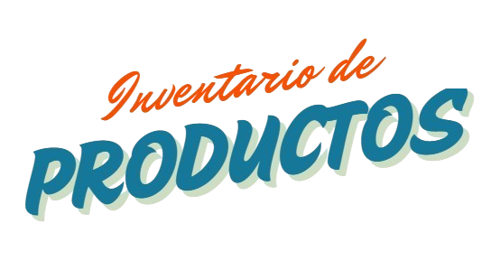](https://is.gd/GzBSAS)
&nbsp;&nbsp;

&nbsp;&nbsp;

&nbsp;&nbsp;
[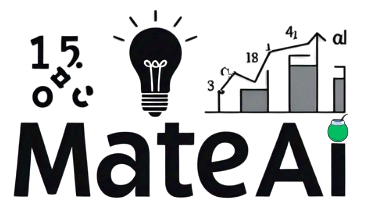](https://is.gd/plhgxu)
&nbsp;&nbsp;
[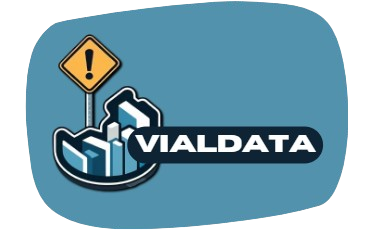](https://is.gd/8CFiYw)
&nbsp;&nbsp;

&nbsp;&nbsp;

&nbsp;&nbsp;

&nbsp;&nbsp;
[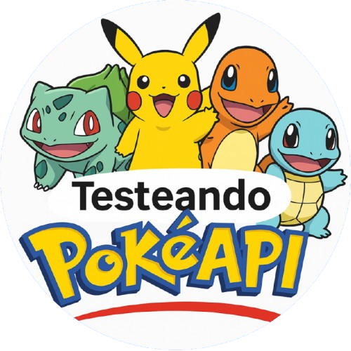](https://is.gd/RAfkn4)
&nbsp;&nbsp;
[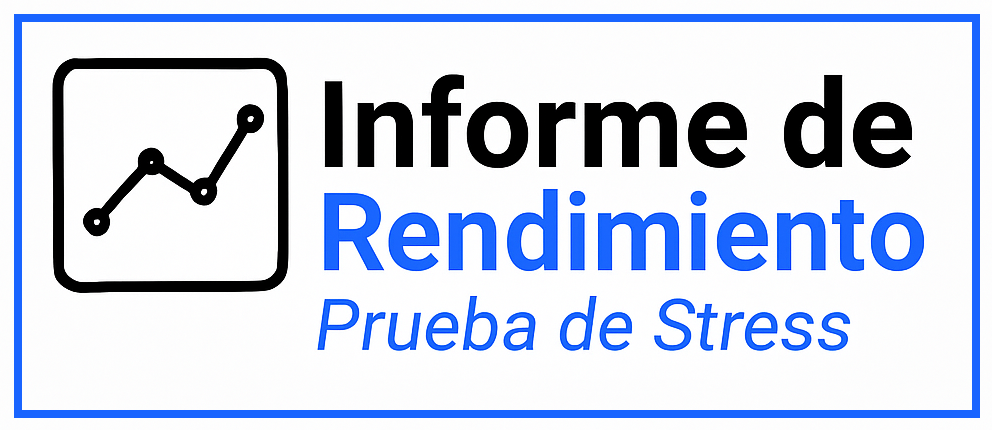](https://is.gd/vBzOgu)
&nbsp;&nbsp;

&nbsp;&nbsp;
[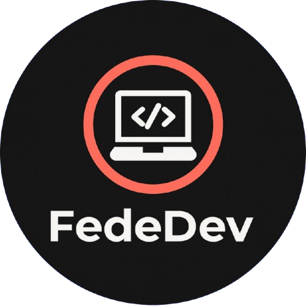](https://is.gd/jMfbIU)
&nbsp;&nbsp;
[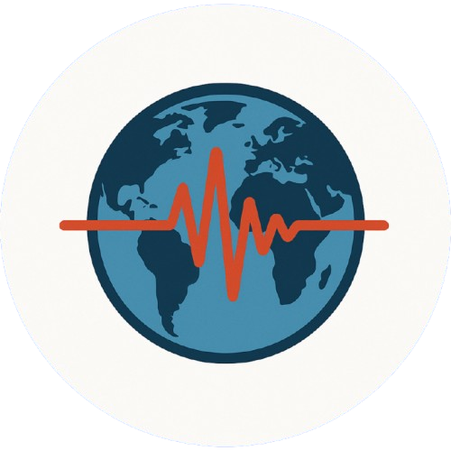](https://is.gd/hPNjih)
&nbsp;&nbsp;
[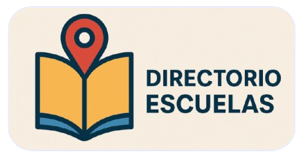](https://is.gd/TIoyr2)
&nbsp;&nbsp;
[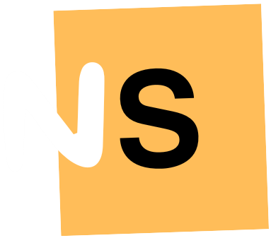](https://is.gd/TRqvxp)
&nbsp;&nbsp;

&nbsp;&nbsp;
[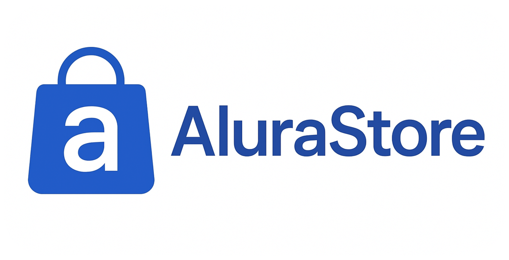](https://is.gd/887wvU)
&nbsp;&nbsp;
[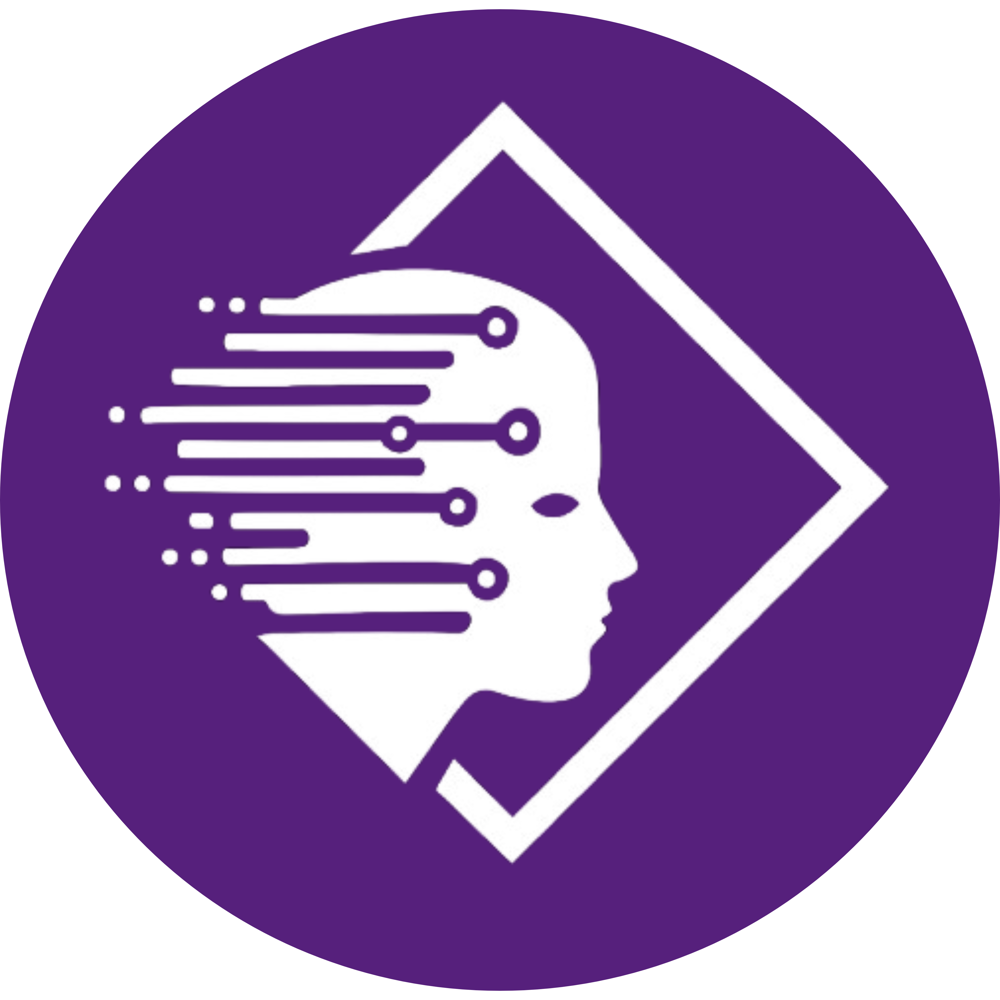](https://is.gd/3flpYT)
&nbsp;&nbsp;
[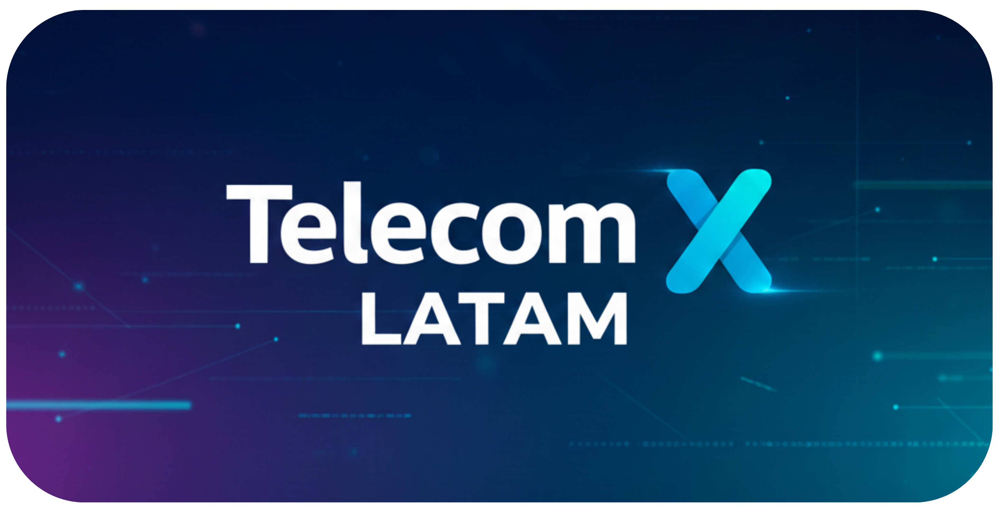](https://is.gd/2VnFZX)
&nbsp;&nbsp;
[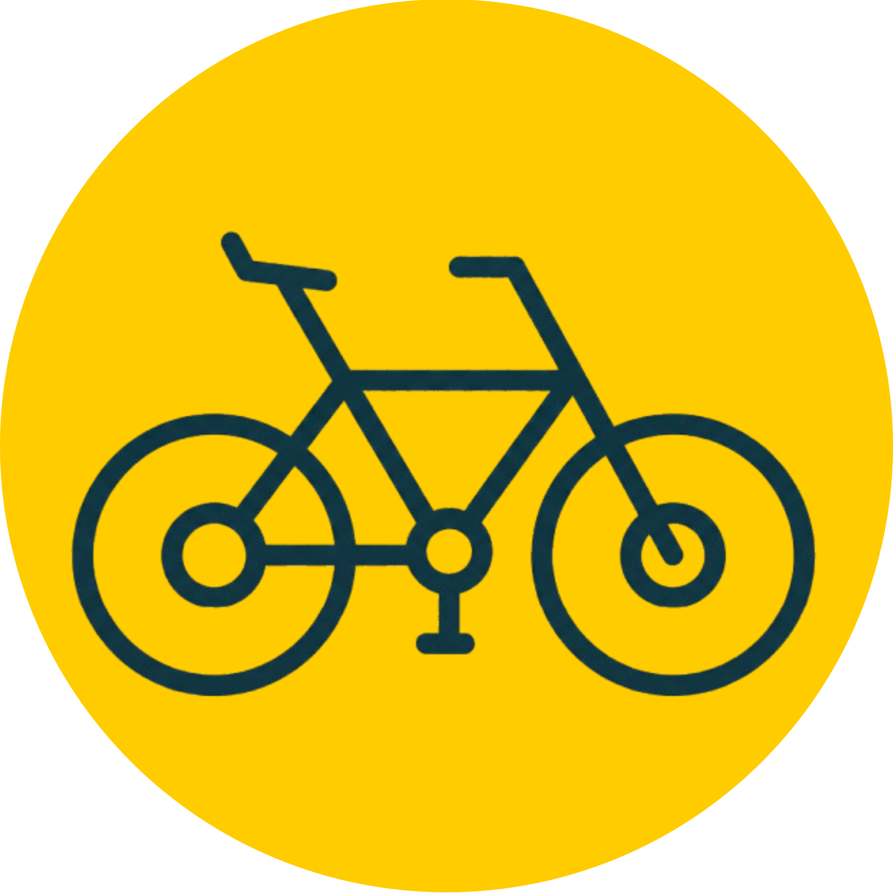](https://is.gd/wyMDud)
&nbsp;&nbsp;

&nbsp;&nbsp;

&nbsp;&nbsp;

&nbsp;&nbsp;

&nbsp;&nbsp;

&nbsp;&nbsp;

&nbsp;&nbsp;
[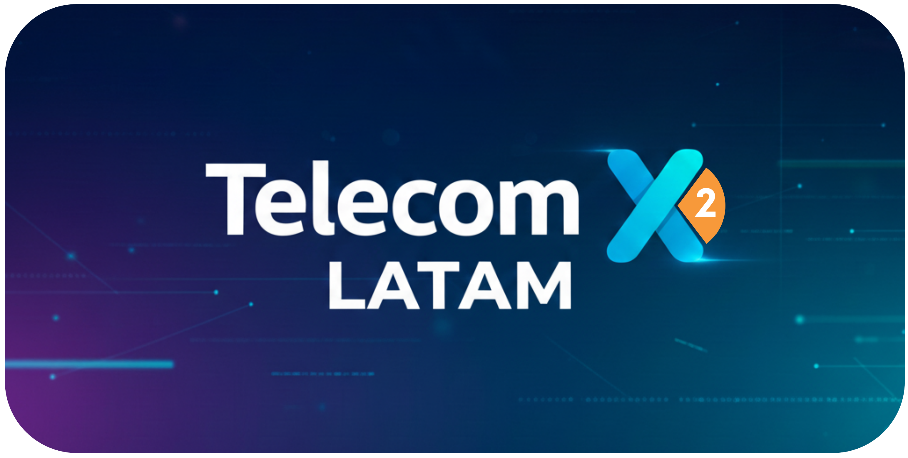](https://is.gd/Fghgwf)
&nbsp;&nbsp;

<h2 align="center">✅ Aprendizaje avalado por ✅ </h2>

&nbsp;&nbsp;

&nbsp;&nbsp;

&nbsp;&nbsp;

&nbsp;&nbsp;

&nbsp;&nbsp;

&nbsp;&nbsp;

&nbsp;&nbsp;
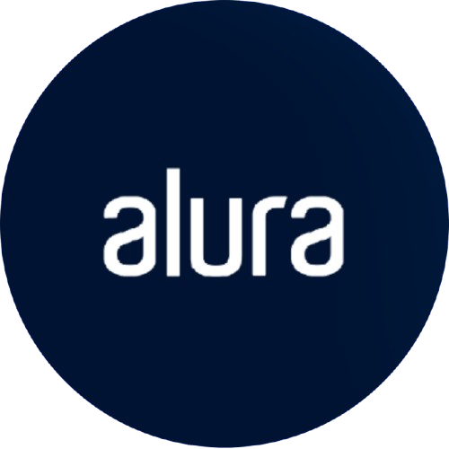
&nbsp;&nbsp;
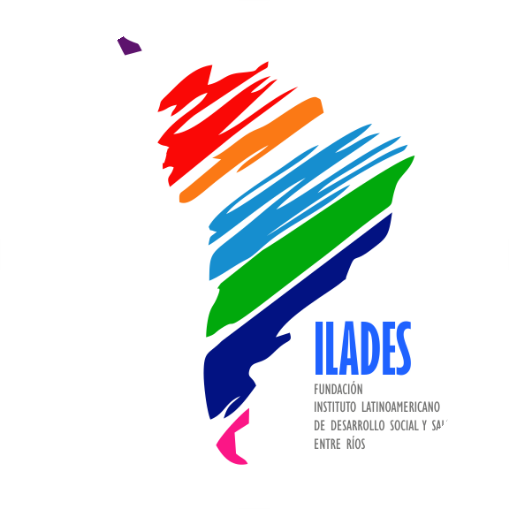
&nbsp;&nbsp;

&nbsp;&nbsp;

&nbsp;&nbsp;

&nbsp;&nbsp;

&nbsp;&nbsp;
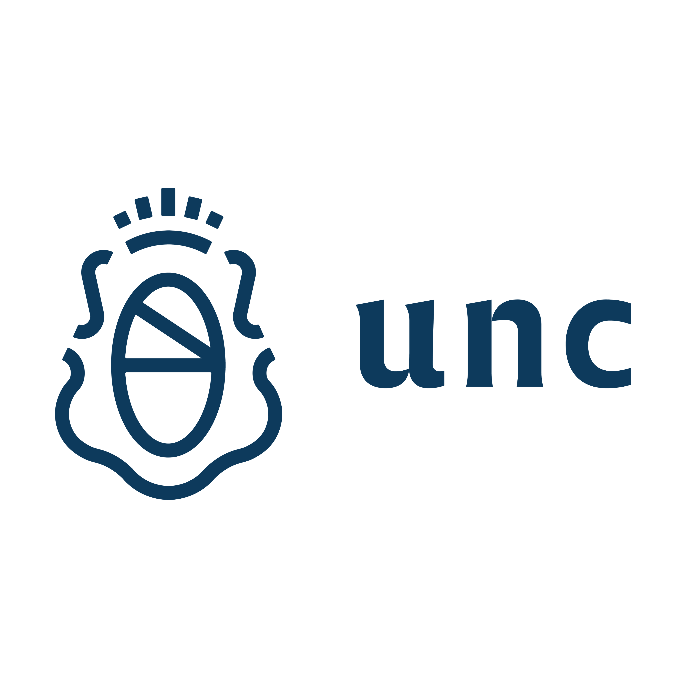
&nbsp;&nbsp;

&nbsp;&nbsp;

<h2 align="center">📫 Contactame en 📫</h2>

    
    &nbsp;&nbsp;
    
    &nbsp;&nbsp;
    

_________________________________________________________________________________________________________
**Última actualización - 01 de abril de 2026**