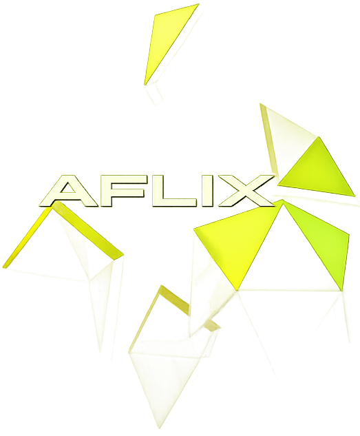

<h1 align="center">Hola 👋   Soy Federico G. Gutierrez</a></h1>

 
     
    
    

- 🧮 Profesor de Matemática

- 👨🏼‍🏫 Estudiante de la `Carrera de Data Scientist` y `Carrera de Data Analytics` en &nbsp;&nbsp;

- 🗂️ Accede a mi [`Portfolio Personal`](https://fedco-gtz.github.io/Portfolio/)

<h2 align="center">🛠️ Lenguajes de programación y herramientas 🛠️</h2>

    
    &nbsp;
    
    &nbsp;
    
    &nbsp;
    
    &nbsp;
    
    &nbsp;
    
    &nbsp;
    
    &nbsp;
    
    &nbsp;
    
    &nbsp;
    
    &nbsp;
    
    &nbsp;
    
    &nbsp;
    
    &nbsp;
    
    &nbsp;
    
    &nbsp;
    
    &nbsp;
    

<h2 align="center">📚 Capacitaciones 📚</h2>

### 🥚 Egg Cooperation

- [Programación desde cero](https://demo-egg-certificates.s3.amazonaws.com/FedericoGabrielGutierrez/programaci%C3%B3ndesdecerolatam/thumbnail_f3842983de1a7d203664e91f8cdc8530d75575d9ea2ae4d3c2e225375682d697.jpeg)
- [Programación Web desde cero](https://demo-egg-certificates.s3.amazonaws.com/FedericoGabrielGutierrez/programaci%C3%B3ndesdecerolatam/thumbnail_f3842983de1a7d203664e91f8cdc8530d75575d9ea2ae4d3c2e225375682d697.jpeg)

---

### 🧉 Argentina Programa 4.0

- [Primeros pasos del desarrollo frontend](https://drive.google.com/file/d/1515Bcy4hGdobzeDxOSyLe5kmVp-0Eq_Y/view?usp=sharing)
- [Desarrollador con conocimientos complementarios en el proceso de datos con Python](https://drive.google.com/file/d/1SkbRNg_086TElDsLmwMBhfzNecy6P1D7/view?usp=sharing)

---

### 💎 Lumetrio
- [Introducción a la Programación](https://drive.google.com/file/d/1qM11ZnACJECziVGvYOQxkq2wPwecFa__/view?usp=sharing)
- [Programación Frontend](https://drive.google.com/file/d/1OHTqBx_DZWGKXOU-r1SgwYlW3X8UjAr9/view?usp=sharing)
- [Python](https://drive.google.com/file/d/1sXe6RLXMNM8Y6rdPhCyferERcLFiYWMA/view?usp=sharing)
- [React](https://drive.google.com/file/d/1ghtuN_Ipzr4gWoJCQJ2vrZeD9N4BzlBk/view?usp=sharing)
- [Git y Github](https://drive.google.com/file/d/1m2wyYarvWTBGiY3KJcAJ2ytHGm7zXPAg/view?usp=sharing)

---

### 🚀 Talento Tech (ex Codo a Codo)
- [Full Stack Python](https://drive.google.com/file/d/1LbpYVB4MvOxZx4rpVx_PH-j8_vhc1e_U/view?usp=sharing)
- [BackEnd Node JS](https://drive.google.com/file/d/1L46wTK7QcFp6lzWnDXjxGAYi7Epablus/view?usp=sharing)
- [Iniciación a la Programación con Python](https://drive.google.com/file/d/1eLMbjnwjVip6VpYYJrvgT7-ySJjnAPiX/view?usp=sharing)

---

### 🟡 Coderhouse
**Frontend y Backend**
- [Desarrollo Web](https://pub.coderhouse.com/legacy-certificates/65c0a148a665c35259cc62a3?lang=es)
- [JavaScript](https://pub.coderhouse.com/legacy-certificates/66158e00451ec417dfb30263?lang=es)
- [React Js](https://pub.coderhouse.com/legacy-certificates/664be1fdc35d22af7ccbacda?lang=es)
- [Carrera de Desarrollo Frontend React](https://pub.coderhouse.com/legacy-certificates/664be1fdc35d221341cbace5?lang=es)
- [Programación Backend I](https://pub.coderhouse.com/legacy-certificates/66a4638e64c8734d4c85aa10?lang=es)
- [Programación Backend II](https://pub.coderhouse.com/legacy-certificates/66f5b32dd1c51d20ed892031?lang=es)
- [Programación Backend III](https://pub.coderhouse.com/legacy-certificates/67506c7b4ea27fc1cf1d02ef?lang=es)
- [SQL](https://pub.coderhouse.com/certificates/d10ebff2-8095-4164-8165-5ec7f5281f9f?v=1)
- [Testing QA Manual](https://pub.coderhouse.com/certificates/b94e5a69-0542-47a6-847e-5211549e2410?v=1)

**Inteligencia Artificial**
- [Fundamentos de Inteligencia Artificial](https://pub.coderhouse.com/certificates/1edc3ff8-fff7-4f18-9b71-234e19d5ee31?v=1)
- [Generación de Prompts con IA](https://pub.coderhouse.com/certificates/b9447d09-9e47-4efb-b76d-cbab513f5fa7?v=1)

**Ciencias de Datos**
- [Data Analytics](https://pub.coderhouse.com/certificates/04a00609-e6f4-4718-9cd0-80a97f114102?v=1)
- [Data Science I: Fundamentos de la Ciencia de Datos](https://pub.coderhouse.com/certificates/d24a529e-67cb-4fba-80bb-9d755e0d9e41?v=1)
- [Data Science II: Machine Learning para la Ciencia de Datos](https://http.cat/401)
- [Data Science III: NLP & Deep Learning aplicado a la Ciencia de Datos](https://http.cat/401)
- [Carrera de Data Scientist](https://http.cat/401)

**Academia de Inglés**
- [Inglés para el mundo digital - Nivel Elementary](https://http.cat/401)

**Análisis de Datos**
- [Excel](https://http.cat/401)
- [Tableau](https://http.cat/401)
- [Data Analytics](https://http.cat/401)
- [Carrera de Data Analytics](https://http.cat/401)

---

### 🔥 Santander Open Academy
- [Google: Inteligencia Artificial y productividad](https://drive.google.com/file/d/1PCssWgcS_NSgHnJycS2aRDsRbbbk2HwK/view?usp=drive_link)
- [GitHub Copilot](https://drive.google.com/file/d/1KHq8STQeGyLAKHRiMj_v7nkCXnpQR7je/view?usp=drive_link)
- [Introducción a la Ciencia de Datos](https://drive.google.com/file/d/1I8JOrpYBE_yUtf77cY-hQ5e-1BtfXvWz/view?usp=drive_link)
- [Power BI](https://drive.google.com/file/d/1iG7jLa-r7vYB1Y1TgPGSiMnYDhrThP6g/view?usp=drive_link)

---

### ✨ Alura LATAM
**Desarrollo Personal G9 - ONE**
- [Aprender a aprender: técnicas para tu autodesarrollo](https://app.aluracursos.com/certificate/c081a1ef-595e-463b-a618-68b4eedf8d31?lang)
- [LinkedIn para profesionales: construye tu marca y genera oportunidades](https://app.aluracursos.com/certificate/cc764e5b-df27-42c3-9334-719b376dc5f7?lang)
- [Foco: Enfocarse trae más resultados para el día a día](https://app.aluracursos.com/certificate/8898bb6c-2cd6-4386-8545-27d4f3910700?lang)
- [Hábitos: Ser productivo para cumplir sus metas personales](https://app.aluracursos.com/certificate/b75b4aa7-d1c5-4a85-94ff-85f705fa8705?lang)
- [Aprendizaje con IA: personalizando tu rutina con ChatGPT](https://app.aluracursos.com/certificate/5666b259-2b89-4a59-a2e5-bc2769573ee5?lang)

**Principiante en Programación G9 - ONE**
- [Lógica de programación: sumérgete en la programación con JavaScript](https://app.aluracursos.com/certificate/d68b8613-59a9-44e8-943a-51773a2b16c5?lang)
- [Lógica de programación: explorar funciones y listas](https://app.aluracursos.com/certificate/fe23c0c2-844f-4757-88a0-2bd00a4972a1?lang)
- [Git y GitHub: repositorio, commit y versiones](https://app.aluracursos.com/certificate/d44f57ac-4e40-4f21-91cd-cd11b6d0c56a?lang)
- [Practicando Lógica de Programación: Challenge Amigo secreto](https://app.aluracursos.com/certificate/84092f4e-198b-4603-9b37-2db5012c1825?lang)
- [IA: explorando el potencial de la Inteligencia Artificial Generativa](https://app.aluracursos.com/certificate/d5f2b90f-a7f8-4efb-a6d5-92b6a0adb40a?lang)
- [Ingeniería de Prompt: creando prompts eficaces para la IA generativa](https://app.aluracursos.com/certificate/68045e66-c905-4d94-b852-d062bf6be19f?lang)
- [HTML y CSS: ambientes de desarrollo, estructura de archivos y tags](https://app.aluracursos.com/certificate/b8833666-3432-44b7-aa5f-161199df0ed8?lang)
- [HTML y CSS: Clases, Posicionamiento y Flexbox](https://app.aluracursos.com/certificate/3372e2e9-b1e3-4225-a322-a3684d9abae3?lang)
- [HTML y CSS: header, footer y variables CSS](https://app.aluracursos.com/certificate/31ba4bfc-55c8-40f9-9e6f-ef139ac6eb53?lang)
- [HTML y CSS: trabajando con responsividad y publicación de proyectos](https://app.aluracursos.com/certificate/b1f65580-c5fd-47a7-af13-df3dd347d0d6?lang)

<h2 align="center">🧑🏽‍💻 Proyectos 🧑🏽‍💻</h2>

&nbsp;&nbsp;

&nbsp;&nbsp;

&nbsp;&nbsp;

&nbsp;&nbsp;

&nbsp;&nbsp;

&nbsp;&nbsp;

&nbsp;&nbsp;

&nbsp;&nbsp;

&nbsp;&nbsp;

&nbsp;&nbsp;

&nbsp;&nbsp;

&nbsp;&nbsp;

&nbsp;&nbsp;

&nbsp;&nbsp;

&nbsp;&nbsp;

&nbsp;&nbsp;

&nbsp;&nbsp;

&nbsp;&nbsp;

&nbsp;&nbsp;

<h2 align="center">✅ Aprendizaje avalado por ✅ </h2>

&nbsp;&nbsp;

&nbsp;&nbsp;

&nbsp;&nbsp;

&nbsp;&nbsp;

&nbsp;&nbsp;

&nbsp;&nbsp;

<h2 align="center">📫 Contactame en 📫</h2>

    
    &nbsp;
    
    &nbsp;
    <a href="mailto:gutierrezfedericog@gmail.com" target="_blank">
    

_________________________________________________________________________________________________________
**Última actualización - 01 de agosto de 2025**